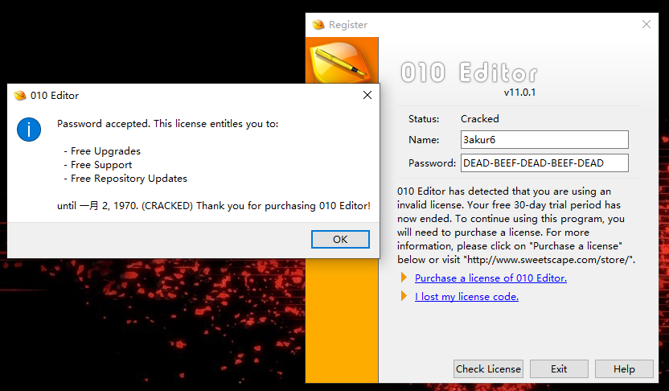
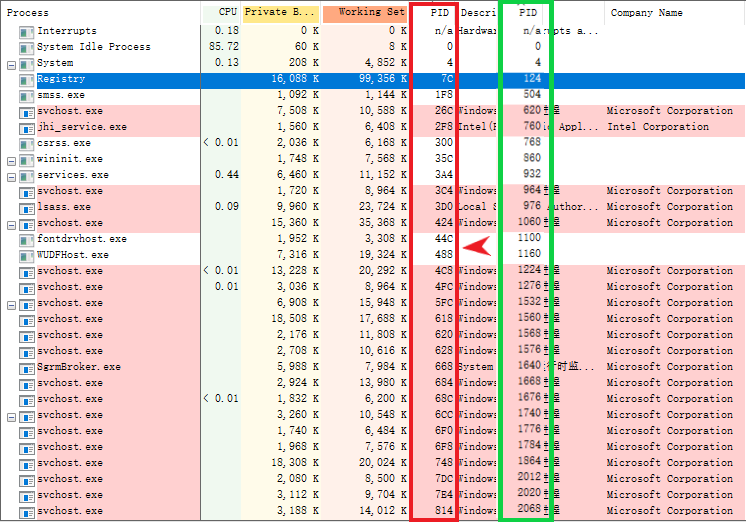
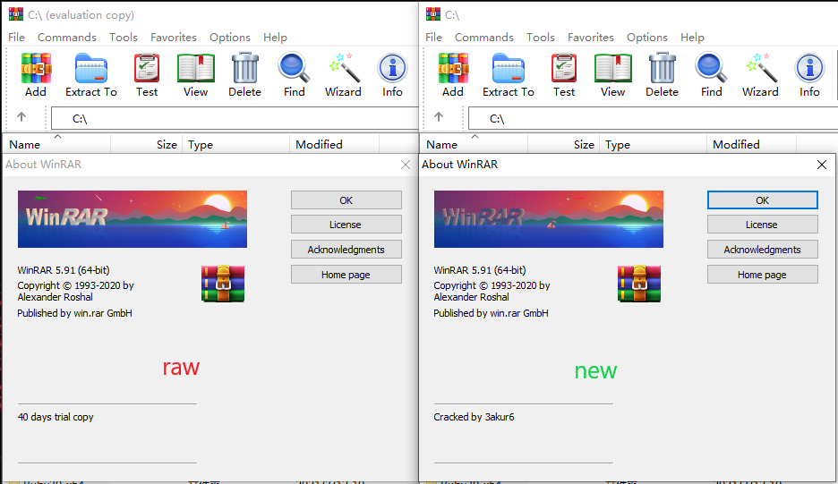

Patch it
----
Crack for **Learning** Purpose   

  - [010Editor](#010Editor)
  - [Process Explorer](#Process-Explorer)
  - [WinRAR](#WinRAR)

## Description
File *.1337 is generated by [x64dbg](https://github.com/x64dbg/x64dbg), telling that the byte from RVA should be changed to the other.    
It is human-readable and used to clearly show the patches for raw file.    

File format:
```
>010editor.exe              # raw file
00000000001E4188:0F->E9     # RVA:from_byte->to_byte
...
```
File *.patch is generated by [bsdiff](https://github.com/mendsley/bsdiff) and used by bspatch to patch raw file.

## Usage
For guys who just want to get patched binary:   
Ensure that [bsdiff/bspatch](https://github.com/mendsley/bsdiff) is within your reach, otherwise get it via your package manager or something.
1. Download patch file(*.patch) you need in this repo.
2. Just patch it!
```zsh
#         raw file      new file              patch
$ bspatch 010Editor.exe 010Editor_patched.exe 010Editor.patch
```

For people who want to learn cracking details:   
Some comments are added to *.1337 so you can import *.1337 in [x64dbg](https://github.com/x64dbg/x64dbg) (File -> Patch file... -> Import) and do some analyses.   
Remember to **delete** these comments before you import *.1337 to x64dbg.

### [010Editor](https://www.sweetscape.com/010editor/)
version: 11.0.1 (64-bit)



* bypass license checking fully (local and online authentification)
* label registration status with 'Cracked'   

-- Note that keygen isn't implemented, but it doesn't matter in fact. Any name-password combination is accepted.

### [Process Explorer](https://docs.microsoft.com/en-us/sysinternals/downloads/process-explorer)
version: 16.32



* convert PID from decimal to hex (corresponding with ollydbg)   
* modify IDT to load dll automatically

-- You need to download procexp.exe (in this repo) with corresponding dll (`procexp.exe` -> `pid2Hex.dll`, `procexp64.exe` -> `pid2Hex64.dll`).

Use [MS-Detours](https://github.com/microsoft/Detours) to implement dll hooking easier. For more technical details, you should check `pid2Hex.cpp`.

### [WinRAR](https://www.win-rar.com/start.html)
version: 5.91 (64-bit)



* eliminate additional words in title
* bypass registration popup
* bypass ads popup
